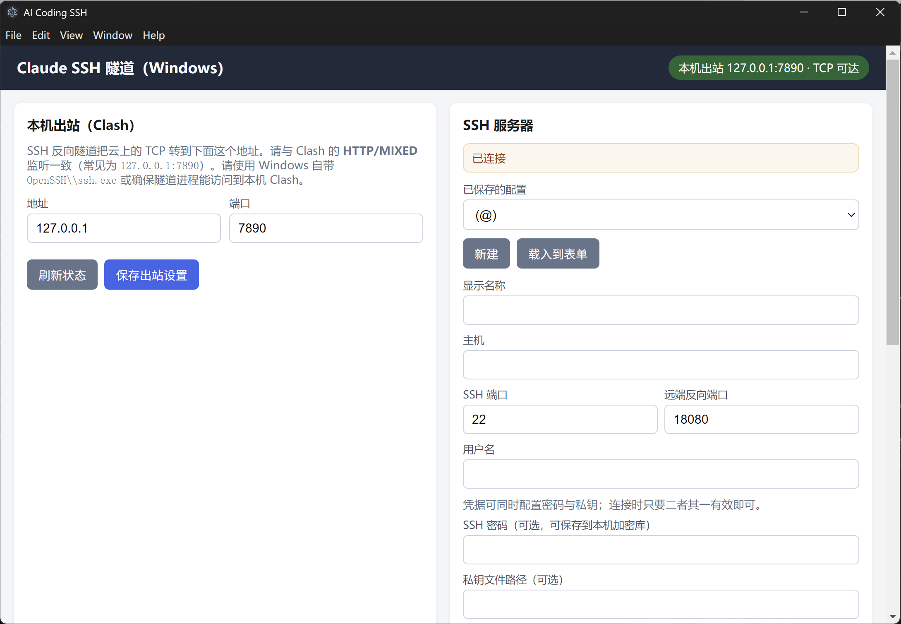

# Claude SSH Tunnel (Windows)

> [中文](./README.md)

[](./LICENSE)

A **Windows desktop app** that sets up an **SSH reverse port forward (`-R`)** to send remote TCP traffic back to your local **Clash** (or any HTTP proxy supporting `CONNECT`), and merges proxy env vars into remote **`~/.claude/settings.json`** for **Claude Code**.



---

## Use case

Run **Claude Code / `claude` CLI** on a cloud VPS while outbound traffic goes through **Clash on your Windows PC**. This GUI handles tunnel setup, connection state, and remote settings merge — no manual `ssh -R` required.

---

## Prerequisites

| Location | Requirement |
|----------|-------------|
| **Local Windows** | Clash (or similar) listening on e.g. `127.0.0.1:7890` (HTTP/MIXED) |
| **Remote server** | OpenSSH; `claude` CLI installed or installable |
| **SSH auth** | Private key path and/or password |

---

## Install & run

```bash
npm install
npm start
```

After `npm install`, you can also double-click **`start-app.bat`** in the repo root.

**Requires** Node.js ≥ 18.

---

## Workflow

1. **Local outbound (Clash)** — set address/port → save. Green status pill means TCP is reachable.
2. **SSH server** — host, user, SSH port, **remote reverse port** (default `18080`), key or password → save.
3. **Connect (reverse tunnel)** → **Write Claude settings** (merges `~/.claude/settings.json`).

Remote self-test:

```bash
curl -v -x http://127.0.0.1:18080 https://api.anthropic.com/ -o /dev/null
```

---

## Windows system tray

- **Minimize / Close** hides the window to the notification area; **tunnels keep running**
- **Left-click** tray icon to show the window again
- Use tray **Exit** to quit and tear down tunnels

Single-instance lock prevents duplicate processes from holding the remote port.

---

## Troubleshooting

- **Disconnect hangs after WiFi drop** — this build uses disconnect timeout, SSH keepalive, and UI busy states. Quit from the tray and restart if needed.
- **Remote port in use on reconnect** — usually a stale SSH session on the **server** (e.g. `:18080`), not local `:7890`. Check with `ss -tlnp | grep 18080` on the remote host.

---

## Batch alternative (no Electron)

See [`scripts/windows/ClaudeSSH隧道.example.bat`](./scripts/windows/ClaudeSSH隧道.example.bat).

---

## Package

```bash
npm run package
npm run make
```

Output under `out/`.

---

## License

MIT
